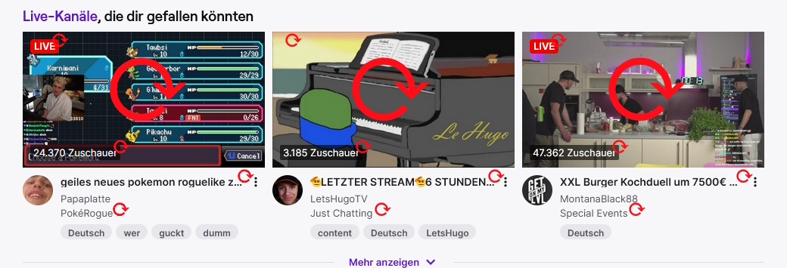

# Twitch Refresh Homepage
Tampermonkey Userscript Updating the Thumbnail, Viewer Count, Title, Game and Live Status of the Recommended Channels on the [Twitch Homepage](https://www.twitch.tv/)

You have the Twitch Homepage open for a long time and want to have updated values without having to reload the page manually? This script is for you

[Install on Greasyfork](https://greasyfork.org/scripts/494170)
 
Recommended: [Twitch Sidebar Thumbnail Preview](https://greasyfork.org/scripts/475701)

